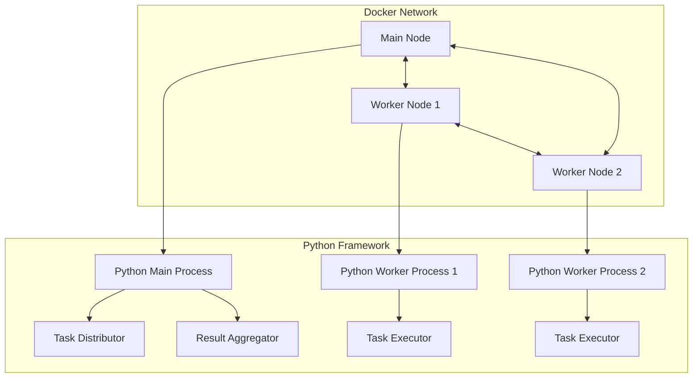

# distributed-computing-data-engineer

This documentation outlines a Docker-based infrastructure for developing a Python framework for distributed computing.
The setup consists of one main node and two worker nodes, all running Ubuntu and capable of communicating with each
other.

