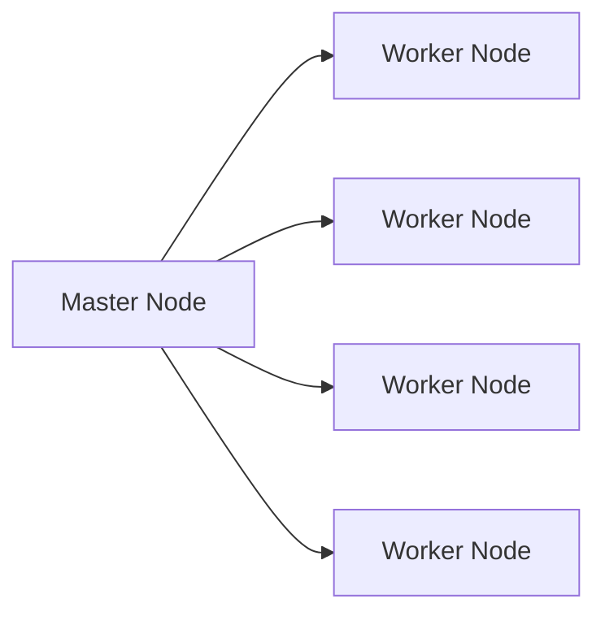
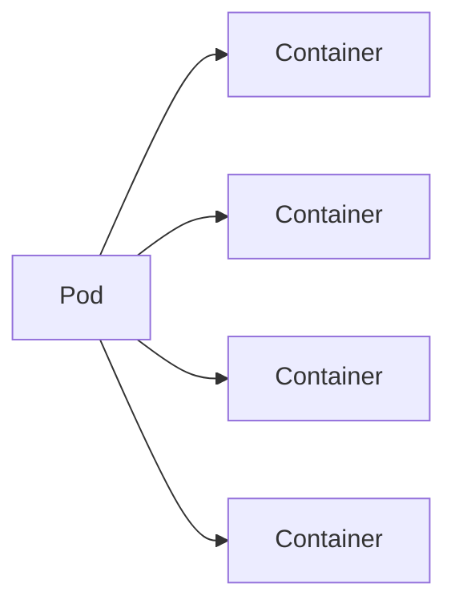

# Introduction to Kubernetes with PySpark: A Home Lab Setup

Welcome to this guide on setting up a Kubernetes (k8s) cluster with PySpark on Ubuntu. This tutorial is designed for
individuals who want to explore and learn about Kubernetes in a home lab environment. It's important to note that this
setup is intended for educational purposes and experimentation, not for production use.

## Purpose of This Guide

- The primary goal of this tutorial is to provide you with hands-on experience in:
- Setting up a basic Kubernetes cluster
- Deploying a distributed Spark environment
- Running PySpark jobs on Kubernetes

This home lab setup will give you a practical understanding of how Kubernetes orchestrates containerized applications
and how it can be used to manage distributed computing tasks like those in Apache Spark.

## What You'll Learn

- By following this guide, you'll gain insights into:
- Basic Kubernetes concepts and components
- Docker containerization for PySpark applications
- Kubernetes resource management for Spark jobs
- Interaction between Kubernetes and Spark

## Important Note

This setup is simplified for learning purposes and is not suitable for production environments. It lacks many features
and security measures that would be necessary in a real-world, production-grade Kubernetes cluster. As you become more
comfortable with Kubernetes, you can explore more advanced topics like high availability, security hardening, and
scalability.

But first...

### What is k8s?

Kubernetes (k8s) is an open-source container orchestration platform that automates the deployment, scaling, and
management
of containerized applications. It was originally designed by Google and is now maintained by the Cloud Native Computing
Foundation.

We use k8s to deploy and manage containerized applications, including distributed systems like Spark, Hadoop, and more.
For this Spark solution, k8s is used to deploy a Spark cluster across multiple nodes, manage resources, and scale the
cluster as needed.

This is a small scale, non production setup, for learning and experimentation.

Here is what a k8s cluster would look like processing data in a typical banking system:



### What is a Pod?

A Pod is the smallest deployable unit in Kubernetes. It represents a single instance of a running process in your
cluster.
Pods contain one or more containers, such as Docker containers. When a Pod runs multiple containers, the containers are
managed as a single entity and share the Pod's resources.

Here is a full-scale diagram to show what I mean one would typically find processing big data:



### What is Helm?

Helm is a package manager for Kubernetes that allows developers and operators to more easily package, configure, and
deploy
applications and services onto Kubernetes clusters. Helm uses a packaging format called charts, which include all of the
Kubernetes resources needed to deploy an application, such as deployments, services, and ingress rules.

For example, some Helm charts are available for deploying Spark, Hadoop, and other big data tools on Kubernetes, and
some common Helm Charts are (and can be set up by):

- Spark
    - `helm install my-release bitnami/spark`
- Hadoop
    - `helm install my-release bitnami/hadoop`
- Kafka
    - `helm install my-release bitnami/kafka`

These are just simple examples.

## 1: Update the System

1. First, ensure your system is up to date:

```shell
sudo apt update && sudo apt upgrade -y
sudo apt install openjdk-17-jdk ufw net-tools python3 python3-pip -y
```

2. Ensure that the necessary ports are open for Kubernetes communication:

```shell
sudo ufw allow 6443/tcp  # Kubernetes API server
sudo ufw allow 2379:2380/tcp  # etcd server client API
sudo ufw allow 10250/tcp  # Kubelet API
sudo ufw allow 10251/tcp  # kube-scheduler
sudo ufw allow 10252/tcp  # kube-controller-manager
sudo ufw allow 10255/tcp  # Read-only Kubelet API
sudo ufw allow 30000:32767/tcp  # NodePort Services
```

3. Ensure IP forwarding is enabled:

```shell
echo "net.ipv4.ip_forward=1" | sudo tee -a /etc/sysctl.conf
sudo sysctl -p
```

4. Verify that your nodes can resolve each other's hostnames:

```shell
sudo nano /etc/hosts
```

Add entries for each node in your cluster:

```shell
<node1_ip> master-node
<node2_ip> worker-node1
# Add more entries as needed
```

5. Ensure all nodes can communicate with each other:

```shell
ping <node-ip-address>
```

## 2: Install Docker

1. Install Docker, which is required for running containerized applications:

```shell
sudo apt install docker.io -y
sudo systemctl enable docker
sudo systemctl start docker
```

2. Add your user to the docker group to run Docker commands without sudo:

```shell
sudo usermod -aG docker $USER
```

Log out and log back in for the changes to take effect.

## 3: Install Kubernetes Components

1. Install kubeadm, kubelet, and kubectl:

- kubeadm: the command to bootstrap the cluster.
- kubelet: the component that runs on all of the machines in your cluster and does things like starting pods and
  containers.
- kubectl: the command line configuration tool.

```shell
# Update the package list
sudo apt update

# Install required packages
sudo apt install -y apt-transport-https ca-certificates curl

# Download the Google Cloud public signing key
curl -fsSL https://pkgs.k8s.io/core:/stable:/v1.28/deb/Release.key | sudo gpg --dearmor -o /etc/apt/keyrings/kubernetes-apt-keyring.gpg

# Add the Kubernetes apt repository
echo "deb [signed-by=/etc/apt/keyrings/kubernetes-apt-keyring.gpg] https://pkgs.k8s.io/core:/stable:/v1.28/deb/ /" | sudo tee /etc/apt/sources.list.d/kubernetes.list

# Update apt package index
sudo apt update

# Install kubelet, kubeadm and kubectl
sudo apt install -y kubelet kubeadm kubectl

# Pin their version
sudo apt-mark hold kubelet kubeadm kubectl
```

## 4: Disable Swap

Why? Kubernetes does not support swap, so you need to disable it. Swap is a space on a disk that is used when the amount
of physical RAM memory is full. When a Linux system runs out of RAM, inactive pages are moved from the RAM to the swap
space.

You can do this by running:

```shell
sudo swapoff -a
sudo sed -i '/ swap / s/^\(.*\)$/#\1/g' /etc/fstab
```

## 5: Configure Kernel Modules and sysctl

Kernel Modules are pieces of code that can be loaded and unloaded into the kernel upon demand. They extend the
functionality of the kernel without the need to reboot the system. In simpler terms; they are device drivers.

sysctl is a tool for examining and changing kernel parameters at runtime. It can be used to read and change the
configuration of many kernel parameters.

1. Enable required kernel modules:

```shell
sudo modprobe overlay
sudo modprobe br_netfilter
```

- modprobe overlay: The overlay module is required by the overlay filesystem, which is used by Docker.
- modprobe br_netfilter: The br_netfilter module is required by the kube-proxy network proxy.

2. Set required sysctl parameters:

```shell
sudo tee /etc/sysctl.d/kubernetes.conf<<EOF
net.bridge.bridge-nf-call-ip6tables = 1
net.bridge.bridge-nf-call-iptables = 1
net.ipv4.ip_forward = 1
EOF

sudo sysctl --system
```

What the above does is set the required sysctl parameters for Kubernetes networking. These parameters ensure that
network traffic is properly routed to the correct pods and services. The net.bridge.bridge-nf-call-ip6tables and
net.bridge.bridge-nf-call-iptables parameters enable iptables to see bridged traffic.

## 6: Initialize Kubernetes Cluster

1. Initialize the Kubernetes cluster:

```shell
sudo kubeadm init --pod-network-cidr=10.244.0.0/16
```

The pod-network-cidr flag specifies the range of IP addresses for the pod network. We use this range
because it is not in use by any other network.

2. Set up kubectl for the non-root user:

```shell
mkdir -p $HOME/.kube
sudo cp -i /etc/kubernetes/admin.conf $HOME/.kube/config
sudo chown $(id -u):$(id -g) $HOME/.kube/config
```

We set it to the non-root user to avoid running kubectl commands as root.
This is a security best practice, since running as root can be dangerous. For example;
if you run a kubectl command that deletes a pod, you could accidentally delete all the pods in the cluster.

## 7: Install Pod Network Add-on

We will use Calico as the pod network add-on. Calico is a popular choice for Kubernetes networking and provides a simple
and scalable networking solution for connecting pods in a cluster. Calico uses the BGP routing protocol to distribute
routes between nodes in the cluster. The BGP protocol is a standard protocol used by routers to exchange routing
information on the Internet. Without this, pods on different nodes would not be able to communicate with each other.

1. Install Calico network add-on:

```shell
kubectl apply -f https://docs.projectcalico.org/manifests/calico.yaml
```

## 8: Allow Scheduling on Master Node

By default, Kubernetes does not allow pods to be scheduled on the master node for security reasons. However, in a
single-node cluster like this one, we want to be able to run pods on the master node.

In a real-world setup; you would have a separate master node and worker nodes. This is done because the master node
is responsible for managing the cluster, while the worker nodes are responsible for running the pods. If we allowed
pods to run on the master node, it could potentially interfere with the master node's ability to manage the cluster.

1. To use the master node for running workloads:

If you want to ensure that pods can be scheduled on the control-plane node (which is necessary for single-node setups),
you can use this command:

```shell
kubectl taint nodes --all node-role.kubernetes.io/control-plane-
```

If you still get an error, it's because there's no taint to remove. In this case, you can safely skip this step.

## 9: Install Helm

1. Helm is a package manager for Kubernetes that we'll use to install Spark operator:

```shell
curl -fsSL https://baltocdn.com/helm/signing.asc | sudo gpg --dearmor -o /etc/apt/keyrings/helm.gpg
echo "deb [arch=$(dpkg --print-architecture) signed-by=/etc/apt/keyrings/helm.gpg] https://baltocdn.com/helm/stable/debian/ all main" | sudo tee /etc/apt/sources.list.d/helm-stable-debian.list > /dev/null

sudo apt update
sudo apt install helm -y
```

## 10: Install Spark Operator

Once Helm is set up, we use Operators to manage complex applications on Kubernetes. Operators are software extensions to
Kubernetes that make use of custom resources to manage applications and their components. The Spark Operator is an
Operator that manages Spark applications on Kubernetes.

1. Add the Spark Operator Helm repository and install it:

```shell
helm repo add spark-operator https://kubeflow.github.io/spark-operator
helm repo update
helm install my-release spark-operator/spark-operator --namespace spark-operator --create-namespace
```

2. Create the "spark" service account:

```shell
kubectl create serviceaccount spark
```

3. Give the service account the necessary permissions:

```shell
kubectl create clusterrolebinding spark-role --clusterrole=edit --serviceaccount=default:spark --namespace=default
```

## 11: Create a Spark Docker Image

Now, we can create a Docker image for Spark that we'll use to run Spark applications on Kubernetes.
We create our own because the official Spark Docker image does not include the Kubernetes dependencies needed to run
Spark on Kubernetes.

1. Create a Dockerfile for PySpark:

```shell
mkdir spark-docker && cd spark-docker
```

2. Create a Dockerfile using Nano

```shell
nano Dockerfile
```

3. Add the following content to the Dockerfile:

```dockerfile
FROM apache/spark:3.4.3

USER root

RUN apt-get update && apt-get install -y python3 python3-pip

COPY requirements.txt .
COPY spark_job.py /opt/spark/work-dir/
RUN pip3 install -r requirements.txt

USER spark
```

4. Create a requirements.txt file with any additional Python packages you need:

```shell
nano requirements.txt
```

Add pyspark:

```requirements
pyspark==3.4.3
```

5. Create a simple PySpark script named spark_job.py:

```shell
nano spark_job.py
```

6. Add the following content to the script:

```python
from pyspark.sql import SparkSession

spark = SparkSession.builder.appName("PySparkJob").getOrCreate()

data = [("Alex", 1), ("Lee", 2)]
df = spark.createDataFrame(data, ["Name", "Age"])
df.show()

spark.stop()
```

7. Build the Docker image:

```text
docker build -t my-pyspark:latest .
```

8. Start a local registry:

```shell
docker run -d -p 5000:5000 --name registry registry:2
```

9. Tag and push your image:

```shell
docker tag my-pyspark:latest localhost:5000/my-pyspark:latest
docker push localhost:5000/my-pyspark:latest
```


## 13: Create a Kubernetes Job for Spark

1. Create a file named spark-job.yaml:

```shell
nano spark-job.yaml
```

2. Add the following content to the file:

```yaml
apiVersion: "sparkoperator.k8s.io/v1beta2"
kind: SparkApplication
metadata:
  name: pyspark-job
  namespace: default
spec:
  type: Python
  pythonVersion: "3"
  mode: cluster
  image: "localhost:5000/my-pyspark:latest"
  imagePullPolicy: IfNotPresent
  mainApplicationFile: local:///opt/spark/work-dir/spark_job.py
  sparkVersion: "3.4.3"
  restartPolicy:
    type: Never
  driver:
    cores: 1
    coreLimit: "1200m"
    memory: "512m"
    labels:
      version: 3.4.3
    serviceAccount: spark
  executor:
    cores: 1
    instances: 2
    memory: "512m"
    labels:
      version: 3.4.3
```

In this config we have the following:

- type: Python: Specifies that this is a Python application.
- pythonVersion: "3": Specifies the Python version to use.
- mode: cluster: Specifies that the application should run in cluster mode.
- image: "my-pyspark:latest": Specifies the Docker image to use.
- imagePullPolicy: Never: Specifies that the image should not be pulled from a registry.
- mainApplicationFile: <path to your spark_job.py>: Specifies the path to the PySpark script.
- sparkVersion: "3.3.0": Specifies the Spark version to use.
- restartPolicy: type: Never: Specifies that the application should not be restarted.
- driver: cores: 1: Specifies the number of cores for the driver.
- coreLimit: "1200m": Specifies the core limit for the driver.
- memory: "512m": Specifies the memory limit for the driver.
- serviceAccount: spark: Specifies the service account to use.

# 14: Run the Spark Job

1. Apply the Spark job to the Kubernetes cluster:

```shell
kubectl get configmap

kubectl apply -f spark-job.yaml
```

2. Monitor the job:

```shell
kubectl get sparkapplications
kubectl describe sparkapplication pyspark-job
kubectl logs pyspark-job-driver
```

3. View the logs:

```shell
kubectl logs -f pyspark-job-driver
```

# Conclusion

You have now set up a Kubernetes cluster on Ubuntu with a distributed Spark environment capable of running PySpark jobs.
This setup allows you to submit and run PySpark code as Kubernetes jobs, leveraging the power of distributed computing.

Remember to clean up resources when you're done:

```shell
kubectl delete -f spark-job.yaml
```

For production environments, consider setting up proper resource management, security measures, and scaling options to
optimize your Spark cluster on Kubernetes.

Happy coding! 🚀
